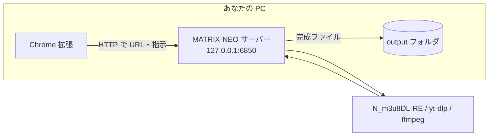

# MATRIX-NEO

**自分の PC 上で動くダウンロード用サーバー**です。ブラウザ（Chrome 拡張）から URL を送ると、裏で **HLS（`.m3u8`）・直リンクの動画・YouTube** などを取得し、`output` フォルダに保存します。

外部ツール（`N_m3u8DL-RE` / `yt-dlp` / `ffmpeg` など）を起動して処理する **FastAPI + uvicorn** の単一プロセス構成です。

---

## 全体の流れ（ざっくり）



| 役割 | 説明 |
|------|------|
| **Chrome 拡張** | ページの URL や設定をサーバーへ送る |
| **サーバー** | キュー管理・進捗・外部ツールの起動 |
| **tools** | 実際のダウンロード・結合・変換（手動で `tools` に exe を置く） |
| **output** | 完成した動画・音声の保存先 |

---

## 始める前に用意するもの

| 項目 | 内容 |
|------|------|
| OS | 主に **Windows**（`build-windows.bat` は Windows 向け） |
| Python | **3.12 または 3.13** 推奨（3.14 は一部パッケージで未対応のことがあります） |
| 外部ツール | `tools` フォルダに **`N_m3u8DL-RE`・`yt-dlp`・`ffmpeg`** など（配布 ZIP 同梱の想定） |
| ブラウザ | **Google Chrome**（拡張を読み込むため） |

---

## 初めて使う人向け：セットアップ手順

### 手順 1：Python の仮想環境を作る

コマンドプロンプトまたは PowerShell で、このリポジトリのフォルダに移動します。

```bat
cd C:\path\to\MATRIX-NEO
python -m venv .venv
.venv\Scripts\activate
python -m pip install -U pip
pip install -r requirements.txt
```

> **うまくいかないとき**  
> `python` が見つからない → [python.org](https://www.python.org/) から Python 3.12/3.13 をインストールし、インストール時に **「Add Python to PATH」** にチェックを入れてください。

### 手順 2：`tools` に exe を置く

`tools` フォルダに、次のような実行ファイルを配置します（名前・入手元はプロジェクトの配布物・ドキュメントに合わせてください）。

| 置くもの（例） | 役割のイメージ |
|----------------|----------------|
| `N_m3u8DL-RE`（または同名 exe） | HLS（`.m3u8`）の取得 |
| `yt-dlp` | YouTube など |
| `ffmpeg` | 変換・結合・コンテナ処理 |

パスは `app/utils/paths.py` の解決ルールに従います。**ここが空だとダウンロード処理が動きません。**

### 手順 3：サーバーを起動する

仮想環境を有効にしたまま：

```bat
python run_server.py
```

次の URL をブラウザで開き、**`"status":"ok"` のような正常応答**が返れば起動できています。

| 確認用 URL | 意味 |
|------------|------|
| http://127.0.0.1:6850/health | サーバーが生きているか |

ポート **6850** は環境変数 `MATRIX_NEO_PORT` で変更できます。

### 手順 4：Chrome 拡張を読み込む

1. Chrome で `chrome://extensions` を開く  
2. **デベロッパーモード**をオン  
3. **パッケージ化されていない拡張機能を読み込む**で、このリポジトリの **`extension` フォルダ**を指定  

拡張の設定画面で、**サーバー URL が `http://127.0.0.1:6850`（または変更したポート）** になっているか確認してください。

### 手順 5：ダウンロードを試す

拡張から動画ページで実行すると、サーバーが処理し、**`output` フォルダ**にファイルができます。  
進捗は拡張の UI や、必要なら `GET /tasks` などの API で確認できます。

---

## フォルダ構成（よく触るところ）

| パス | 何が入るか |
|------|------------|
| `app/` | サーバー本体（API・設定・処理ロジック） |
| `run_server.py` | 起動スクリプト（`uvicorn` で `127.0.0.1` にバインド） |
| `tools/` | 外部コマンド用 exe（**自分で配置**） |
| `output/` | **ダウンロード結果の保存先** |
| `temp/` | 一時ファイル |
| `extension/` | Chrome 拡張（ソースをそのまま読み込み） |
| `.env` | 任意。環境変数を書く（`.env.example` をコピーして編集） |

ルートの `main.py` は後方互換用の薄いラッパーです。配布用 **exe** を作るときは `matrix-neo.spec` と `build-windows.bat` を使います。

---

## よく使う環境変数

`.env` に書くか、PowerShell では `$env:変数名 = "値"` で設定します。一覧の雛形は **`.env.example`** にあります。

| 変数 | 既定 | 意味（ざっくり） |
|------|------|------------------|
| `MATRIX_NEO_PORT` | `6850` | 待ち受けポート |
| `MATRIX_NEO_LOG_LEVEL` | `INFO` | ログの詳しさ |
| `MATRIX_NEO_BLOCK_PRIVATE_IPS` | `0` | `1` だとプライベート IP の URL を拒否（LAN 再生などは壊れやすい） |
| `MAX_CONCURRENT_DOWNLOADS` | `10` | 同時に走らせるダウンロード数 |
| `MATRIX_NEO_TASK_TTL_HOURS` | `24` | 完了・エラー・停止タスクをメモリから消すまでの時間 |

HLS の細かい調整（スレッド数・リトライ・速度上限など）は `.env.example` の `MATRIX_NEO_M3U8_*` を参照してください。

---

## トラブル時のヒント

| 症状 | 試すこと |
|------|----------|
| ブラウザから繋がらない | サーバーを起動したか、`127.0.0.1` と **ポート番号**が拡張と一致しているか |
| ダウンロードが始まらない | `tools` に必要な exe があるか、`/health` は成功するか |
| 429 や途中で止まる（0.00Bps など） | 配信側の制限の可能性。スレッドや速度を下げる（例：`MATRIX_NEO_M3U8_THREADS`、`MATRIX_NEO_M3U8_MAX_SPEED`） |
| Stop All 後に完成ファイルが消える | v3.2.0 以前の不具合。**v3.2.1** 以降は完了タスクは Stop 対象外 |
| サーバー起動ボタンが早く失敗する | venv 初回起動は 15 秒超かかることがある。**v2.1.8** 以降は background が 3 秒間隔で `/health` を監視し、起動待ちは最大 **45 秒** |
| `Error: Server offline`（サーバーは起動済み） | 拡張を **再読み込み**（`chrome://extensions`）。Side Panel ではなく **background（Service Worker）** がヘルスチェックの正本。**127.0.0.1:6850** を使う（`localhost` は IPv6 で届かないことがある） |
| Windows が FFmpeg 7.1.x の脆弱性を警告 | WinGet の **Gyan.FFmpeg 7.1.1**（PATH）が対象。NEO は `tools\ffmpeg.exe` を使用 — `tools\sync-ffmpeg.bat` 実行後 `/health` の `ffmpeg_version` を確認 |
| 検出一覧が消える | **v3.2.1** 以降 `chrome.storage.session` に保持（同一ブラウザセッション内） |

詳しい調整例は従来どおり、環境変数で **スレッド・リトライ・最大速度・`-mt` の有無** を変えて試せます。

```powershell
$env:MATRIX_NEO_M3U8_THREADS = "8"
$env:MATRIX_NEO_M3U8_MT = "0"
$env:MATRIX_NEO_M3U8_MAX_SPEED = "8M"
python run_server.py
```

- 初回起動時、Windows ファイアウォールの許可ダイアログが出ることがあります。  
- PyInstaller で作った exe はウイルス対策に誤検知されることがあります。

---

## 変更履歴（直近）

| 版 | 主な修正 |
|----|----------|
| **3.2.1** | Stop All で完成ファイルが消える不具合、`active_downloads` 掃除、dedup 原子化、resume 同一 task_id、HLS 中間ファイル掃除、Stop All 並列化 |
| **3.2.1 拡張** | 検出リスト session 永続化、SSE 指数バックオフ、起動ポーリング、履歴二重登録防止、popup 削除 |
| **2.1.8 拡張** | background 定期ヘルス監視（storage 同期）、起動待ち 45 秒、`127.0.0.1` 明示 host_permissions |
| **3.2.2** | FFmpeg 同梱優先（`tools/ffmpeg.exe`）、`/health` に ffmpeg_version、`sync-ffmpeg.bat` |

---

## Windows で exe をビルドする（任意）

普段の開発は `python run_server.py` だけで構いません。単一 exe が必要なときだけ：

1. `build-windows.bat` を実行  
2. `dist\MATRIX-NEO-Server\MATRIX-NEO-Server.exe` が生成される  

配布用にフォルダをまとめるときは、`dist` の出力に加えて **`tools`・`extension`・空の `output` / `temp`** などを同梱する形が想定されています。

---

## 開発者向け：テスト

```bat
.venv\Scripts\activate
pip install -r requirements-dev.txt
python -m pytest -v
```

---

## ライセンス・注意

本 README の構成・表記は読みやすさ優先で整理しています。利用条件やライセンスはリポジトリのライセンスファイルに従ってください。
